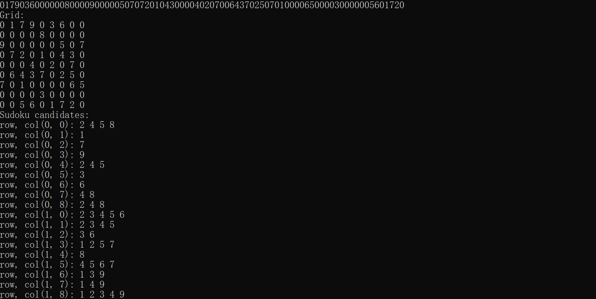

### 2024面向对象技术 数独作业

#### 1 组织目录

````
.
├── sudoku.cpp
├── sudoku.py
└── README.md
````


#### 2 如何开始

先克隆项目到本地

````sh
git clone https://github.com/Mikochi13/OOP-sudoku.git
````

##### 2.1 cpp

如果需要运行`sudoku.cpp`，则

````
g++ sudoku.cpp -o sudoku
./sudoku
````

然后输入数独字符串即可。

##### 2.2 python

如果需要运行`sudoku.py`，则

````
python sudoku.py
````

然后输入数独字符串即可。


#### 3 运行示例

